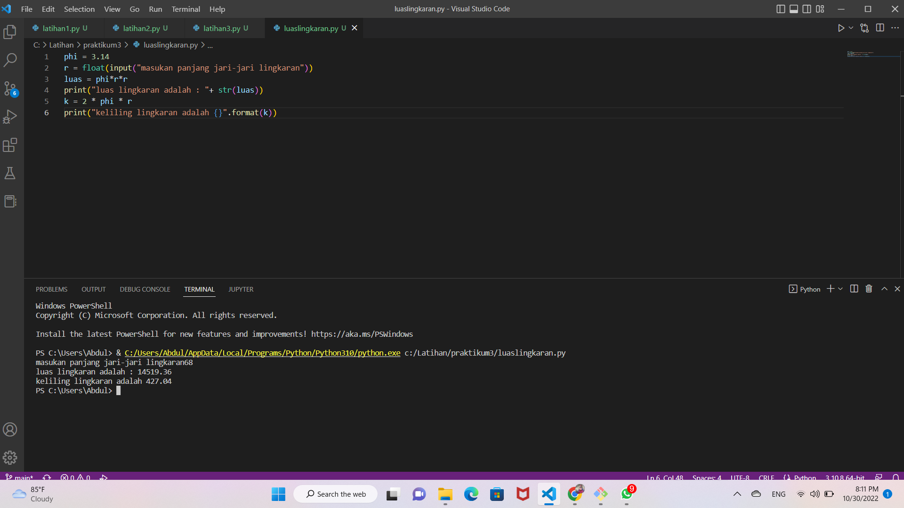
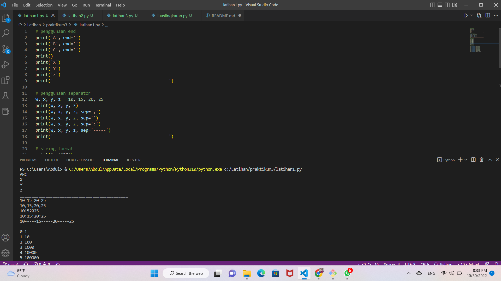
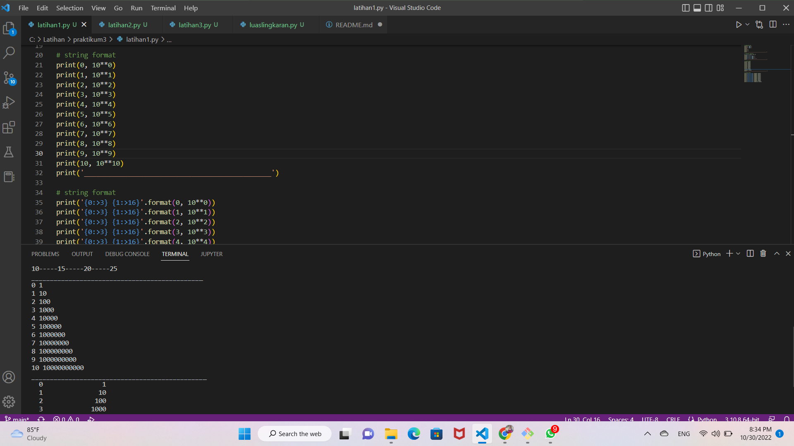
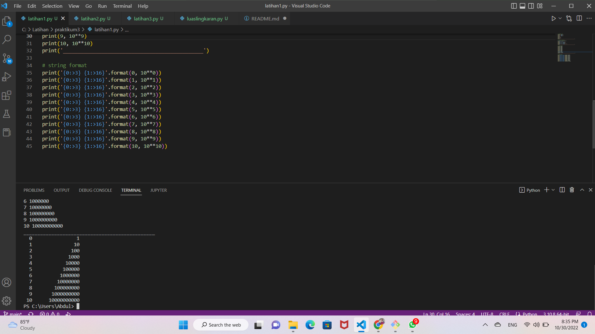
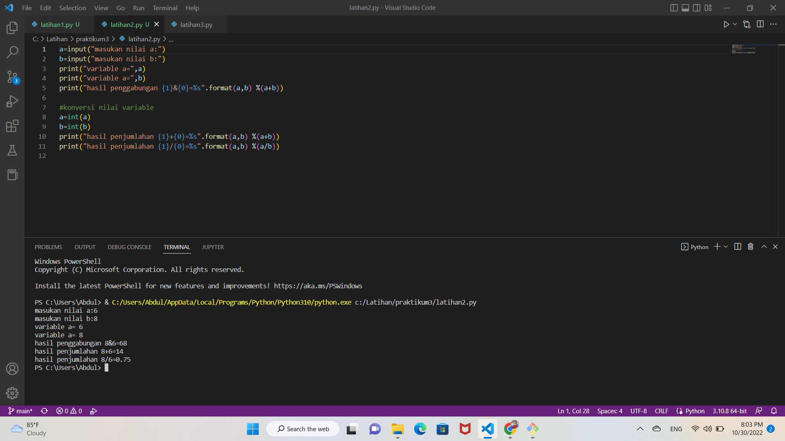
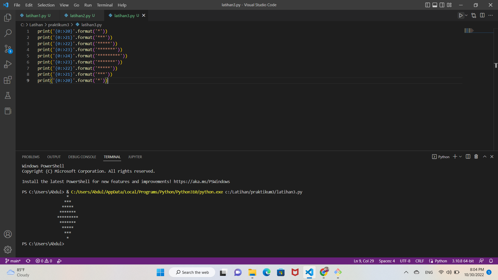

# flowchart
# latihan 1
# latihan 2
# latihan 3
# luas keliling lingkaran

# luas keliling lingkaran

<p1>Baris 1 : mendeklarasikan variable phi dengan nilai 3.14 

<p2>Baris 2 : mendeklarasikan variable r serta memasukkan nilai jari-jari lingkaran bertipe float yang didapat dari user. 

<p3>Baris 3 : mendeklarasikan variable luas dimana nilai variable tersebut didapat dari perhitungan luas, dimana nilai variable phi dikali nilai variable r lalu dikali dengan variable r dan hasilnya akan dimasukkan kedalam variable luas. 

<p4>Baris 4 : menampilkan nilai dari variable luas. 

<p5>Baris 5 : perhitungan keliling dimana dua dikali dengan nilai variable phi dikali nilai variable r dan hasilnya akan dimasukkan kedalam variable k. 

<p6>Baris 6 : menampilkan nilai dari variable k.

# luas keliling lingkaran

# flowchart

# hasil latihan 1

<p1>"penggunaan end"

<p2>kalimat yang disertai end hasilnya akan menyambung

<p3>sedangkan kalimat yang tidak disertai kata end hasilnya akan pindah barisan ke bawah

<p4>"penggunaan separator"

<p6>penggantian huruf menjadi angka
<p7>w=10 x=15 y=20 z=25

<p1>"string format"

tanpa program peletakan angka itu akan tampil dimana

"string format"

dengan program peletakan hasil yang akan tampil di space tertentu

# hasil latihan 2

<p1>baris 1 sampai 5 menjelaskan program input nilai 
yang akan di konversi nilai variable nya

<p2>baris 8 sampai 11 adalah hasil inputan nilai yang telah
ditentukan sebelumnya

# hasil latihan 3

<p1>program peletakan posisi dimana symbol itu akan tampil
